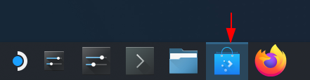

# Installing Pylux

=== "Android / Android TV"

    Install directly from the Play Store:

    [Get it on Google Play](https://play.google.com/store/apps/details?id=com.pylux.stream){ target="_blank" rel="noopener" }

    Works on phones, tablets, and Android TV devices.

=== "iOS / iPadOS"

    Install from the App Store:

    [Download on the App Store](https://apps.apple.com/us/app/pylux-remote-play/id6761292658){ target="_blank" rel="noopener" }

=== "macOS"

    Install from the Mac App Store:

    [Download on the Mac App Store](https://apps.apple.com/us/app/pylux-remote-play/id6761292658){ target="_blank" rel="noopener" }

=== "Windows"

    - [Installer](https://www.dropbox.com/scl/fi/wf9cr349acdwkih0syrva/pylux-windows-installer-latest.exe?rlkey=m2egtuj8z7f5se6405gg09wct&dl=1){ target="_blank" rel="noopener" } — recommended for most users
    - [Portable zip](https://www.dropbox.com/scl/fi/153m9nvy9jluxcjvngmwb/pylux-latest.zip?rlkey=l3bxdp67hu2apfazjs27edxtw&dl=1){ target="_blank" rel="noopener" } — unzip and run, no install required

=== "Linux / Steam Deck"

    !!! tip "Steam Deck"
        Flatpak is the recommended install for Steam Deck — it integrates with the Discover store and updates automatically.

    !!! Tip "Copying from and Pasting into Konsole Windows"

        You can copy from and paste into `konsole` windows with ++ctrl+shift+c++ (copy) and ++ctrl+shift+v++ (paste) instead of the normal ++ctrl+c++ (copy) and ++ctrl+v++ (paste) shortcuts.

    === "Flatpak (Recommended)"

        === "Using the Discover Store"

            1. Open the Discover store

                

            2. Search for `Pylux` in the search bar

            3. Click Install

        === "Using the `konsole`"

            1. Run the following command in the `konsole`

                ```
                flatpak install flathub io.github.ForWard_Technologies_LLC.Pylux -y
                ```

        !!! Note "About the Pylux Flatpak"

            The Pylux flatpak is available on [Flathub](https://flathub.org/apps/io.github.ForWard_Technologies_LLC.Pylux){ target="_blank" rel="noopener" }.

            You can also build the flatpak yourself by following the instructions in [Building the Flatpak Yourself](../diy/buildit.md){ target="_blank" rel="noopener" }.

    === "AppImage"

        1. Download the [AppImage](https://www.dropbox.com/scl/fi/wi8bjilwiklv7fde0b4ea/pylux-latest.AppImage?rlkey=3xne4ltuiq54ogfmng4gq24mp&dl=1){ target="_blank" rel="noopener" }

        2. Make it executable and run it:

            ```bash
            chmod +x pylux-latest.AppImage
            ./pylux-latest.AppImage
            ```

            !!! Tip "Steam Deck / Steam"
                Set `APPIMAGE_EXTRACT_AND_RUN=1` if Steam misbehaves with the AppImage.

    === "Portable zip"

        1. Download the [portable zip](https://www.dropbox.com/scl/fi/86rm2424t8jv1h4p2id2b/pylux-latest.zip?rlkey=w69lgzvauq43wpi35wtqac2h0&dl=1){ target="_blank" rel="noopener" }

        2. Unzip and run `launch.sh` (sets up bundled libs and OpenSSL fallback automatically)
